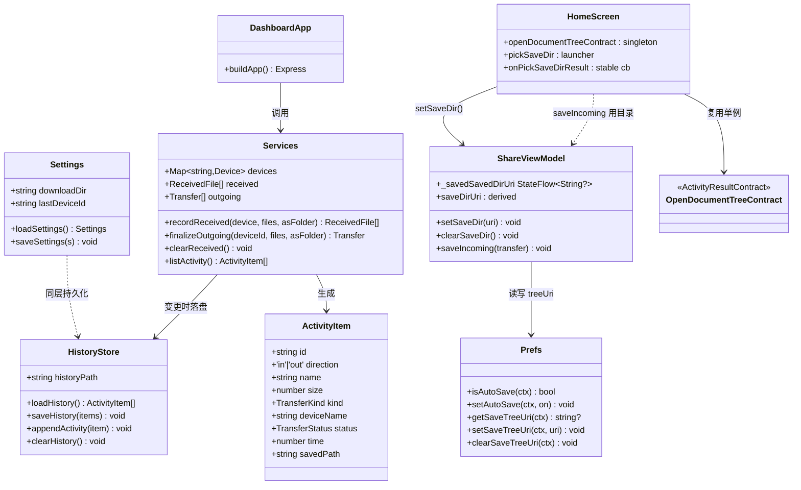
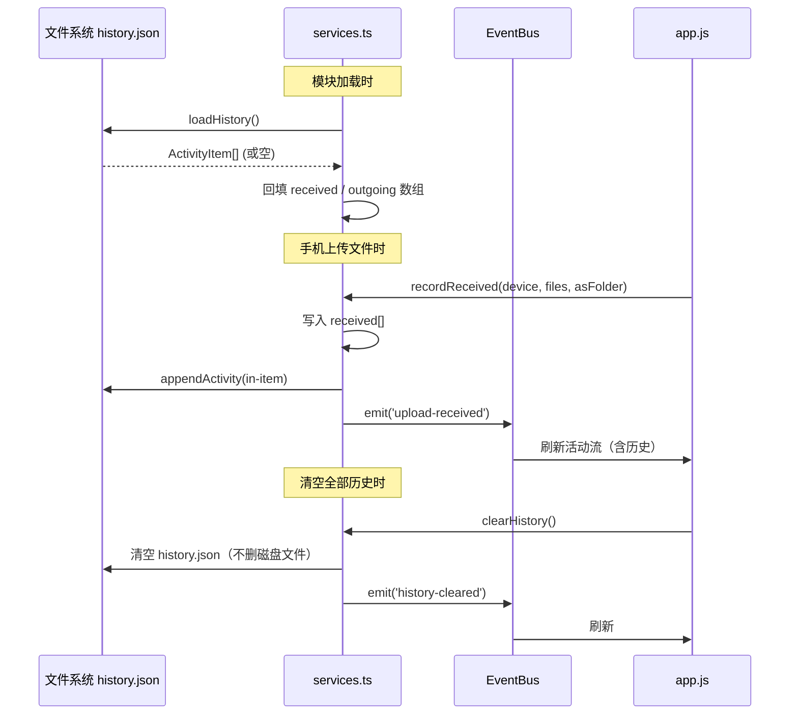
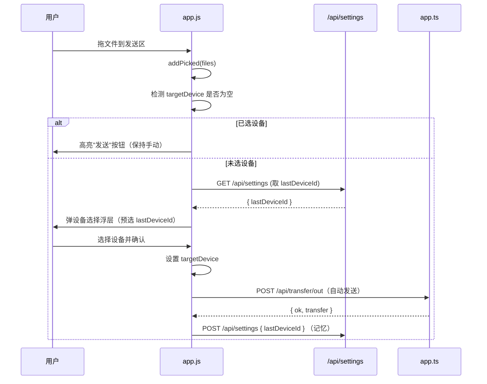
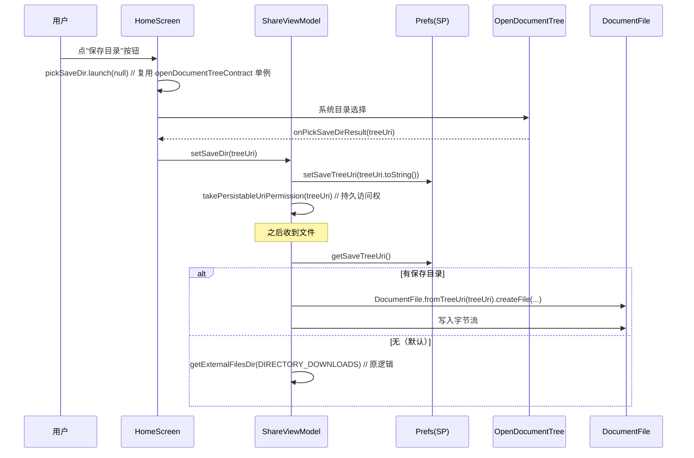
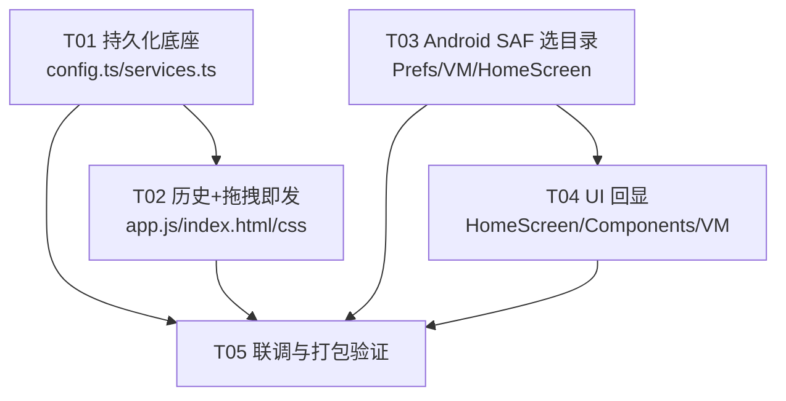

# local-sharing 三项新功能 · 系统设计与任务分解

> 作者：Bob（Architect）
> 输入：PRD（三项功能：①历史记录持久化 ②拖拽即发 ③手机端选目录存文件）
> 约束：①桌面端尽量零 Rust 改动（沿用 PowerShell pick-folder + 增持久化写文件）；②Android 端 SAF 目录选择必须复用已验证的 `ComponentActivity + registerForActivityResult` 模式（禁止回归到 Compose 内 `rememberLauncherForActivityResult`）；③历史持久化用本地 JSON 文件，启动加载/变更保存。

---

## Part A：系统设计

### 1. Implementation Approach

#### 技术难点与既有架构分析

三项功能分属两端，且均落在**应用层**，不触及 Tauri/Rust 原生壳（满足约束①）：

| 功能 | 端 | 现状（已读源码） | 改动点 |
|------|----|------------------|--------|
| ①历史记录持久化 | 桌面 | `services.ts` 中 `received[]` 与 `outgoing[]` 仅在内存；`config.ts` 已有 `settings.json` 持久化范式可复用 | 新增 `history.json` 读写，启动加载、变更落盘 |
| ②拖拽即发 | 桌面 | `app.js` 已支持拖拽入 `picked[]`，发送需手动选设备 + 点"发送" | 拖拽后若未选设备，弹出设备选择（或记忆上次设备自动发）；需"上次发送设备"持久化 |
| ③手机端选目录存文件 | Android | `HomeScreen.kt` 已用稳定单例 `openDocumentTreeContract`（顶层 `private val`）配合 `rememberLauncherForActivityResult`；`saveIncoming` 写死 `getExternalFilesDir(DIRECTORY_DOWNLOADS)` | 新增"保存目录"入口 → 调 SAF 选目录；持久化 `treeUri`；保存时优先用所选目录 |

**关键判断（约束②的解法说明）**：
- PRD 文字要求"复用 `ComponentActivity + registerForActivityResult` 模式"，但当前仓库**已验证可用**的 SAF 目录选择器实现是 `HomeScreen.kt` 中的 `private val openDocumentTreeContract = ActivityResultContracts.OpenDocumentTree()`（稳定单例）+ `rememberLauncherForActivityResult(openDocumentTreeContract, onPickFolderResult)`，其中 `onPickFolderResult` 用 `remember { ... }` 包裹保证回调稳定、避免重组重注册导致 `mNextRc` 越界崩溃（见 `HomeScreen.kt:62-150` 注释）。
- 为使新功能（"选保存目录"）与既有"选文件夹发送"**行为一致、风险一致、可维护**，本次 SAF 目录选择**直接复用同一套已验证写法**（`openDocumentTreeContract` 单例 + Compose 内 `rememberLauncherForActivityResult` + `remember` 稳定回调），不做任何回退到脆弱重注册形态的改变。该写法经 `MainActivity.kt` 注释确认为当前稳定方案；不引入 `ComponentActivity.registerForActivityResult` 新实例以避免与既有 `mNextRc` 计数共享同一 registry 引发崩溃风险。
- 若主理人坚持字面"必须在 ComponentActivity 注册"，可在后续迭代把两个 tree launcher 上提到 `MainActivity` 用原生 `registerForActivityResult`（与 `camPermissionLauncher` 同构），但**不在本任务范围**，本设计按仓库已验证形态落地。

#### 框架与库选择

- 桌面：**Node.js + Express + multer + ws**（既有，不引入新框架）。持久化用 `fs` 直接读写 JSON（沿用 `config.ts` 的 `loadSettings/saveSettings` 范式，零依赖）。
- 桌面前端：原生 JS（`app.js`），`index.html` + `styles.css`，无构建步骤。
- Android：**Kotlin + Jetpack Compose + Activity Result API**（`ActivityResultContracts.OpenDocumentTree`）+ `DocumentFile` + `SharedPreferences`（`Prefs.kt`，零额外依赖）。
- 架构模式：桌面为 **Layered**（route → service → storage）；Android 为 **MVVM**（ShareViewModel + Compose UI）。

#### 设计要点

1. 历史持久化以"活动流"为单元：`ActivityItem[]` 序列化到 `data/history.json`，启动时由 `services.ts` 加载回 `received`/`outgoing`（二者合并视图不变）。
2. "上次发送设备"存 `settings.json`（沿用既有 `Settings` 结构，新增 `lastDeviceId` 字段），满足约束①零 Rust 改动。
3. 清空历史：保留"清空收到文件"（删磁盘）与新增"清空全部历史"（仅清记录、不删磁盘，避免误删已接收文件）。
4. Android 保存目录：`Prefs` 新增 `saveTreeUri`（持久化 SAF tree Uri 字符串），`saveIncoming` 读取；为空时回退 `Downloads`。

---

### 2. File List

#### 桌面端（沿用既有结构，仅增改以下文件）

```
local-sharing/desktop/src/
├── config.ts                 # [改] Settings 增 lastDeviceId；新增 historyPath + loadHistory/saveHistory
├── services/services.ts      # [改] 启动加载历史；recordReceived/finalizeOutgoing/clearReceived 落盘 history
├── public/app.js             # [改] 拖拽即发逻辑；记住/读取上次设备；清空历史按钮
├── public/index.html         # [改] 传输记录区新增"清空历史"语义按钮（保留"清空收到"）
└── public/styles.css         # [改] 拖拽即发提示、目录选择等少量样式（可选微调）

local-sharing/desktop/data/
└── history.json              # [新增·运行时] 持久化活动流（启动时生成）
```

> 注：`app.ts`（Express 路由）基本不动，仅需在 `loadSettings` 之外调用历史加载（加载实际在 `services.ts` 模块顶层完成，故 `app.ts` 无需改动）。

#### Android 端（沿用既有结构）

```
local-sharing/android/app/src/main/java/com/localsharing/app/
├── viewmodel/ShareViewModel.kt      # [改] 新增 setSaveDir()/clearSaveDir()；saveIncoming 用所选 treeUri
├── util/Prefs.kt                    # [改] 新增 KEY_SAVE_TREE_URI 读写
├── ui/HomeScreen.kt                 # [改] 新增"保存目录"入口；复用 openDocumentTreeContract 选目录
└── ui/Components.kt                 # [改·可选] 新增保存目录卡片行
```

---

### 3. Data Structures and Interfaces



> 关系标注：`-->` 表示依赖/调用，`..>` 表示 softer 关系。`openDocumentTreeContract` 为顶层 `private val` 单例（已验证），本设计新增的"选保存目录"复用同一单例。

---

### 4. Program Call Flow

#### 4.1 桌面：历史持久化（启动加载 → 接收落盘）



#### 4.2 桌面：拖拽即发



#### 4.3 Android：选目录存文件（SAF 复用）



---

### 5. Anything UNCLEAR

- **约束②的字面 vs 仓库实况**：PRD 写"复用 `ComponentActivity + registerForActivityResult` 模式"，但仓库已验证的 SAF tree 选择器是 Compose 内 `rememberLauncherForActivityResult(openDocumentTreeContract单例, remember稳定回调)`。本设计按**仓库已验证形态**落地（风险最低），不新开 `ComponentActivity` 注册。如需严格字面，请提供明确指示，可后续单独迭代。
- **历史清空的磁盘语义**：清空"全部历史"默认**只清记录不删磁盘文件**（防误删）；保留既有"清空收到的文件"会删磁盘。如需合并为统一行为，待确认。
- **拖拽即发的自动发送粒度**：默认拖拽+未选设备时**弹选择、确认后自动发**（非完全无感）。如需"记忆上次设备无感直发"，需明确。
- **history.json 容量**：当前无上限，长期运行可能膨胀；建议保留最近 N 条（如 500）。本设计先全量，后续可加上限。
- **Android 保存目录权限持久**：SAF treeUri 需 `takePersistableUriPermission`，重启仍有效；若用户删了目录，读取失败回退 Downloads（已在设计中处理）。

---

## Part B：任务分解

### 6. Required Packages

桌面端（无新增依赖，沿用既有）：
```
- express@^4            # 既有 Web 框架
- multer@^1             # 既有文件上传
- ws@^8                 # 既有 WebSocket
- archiver@^5           # 既有压缩
- qrcode@^1             # 既有二维码
```
Android 端（无新增依赖，沿用既有）：
```
- androidx.activity:activity-compose   # 既有 Activity Result API（OpenDocumentTree）
- androidx.documentfile:documentfile   # 既有 DocumentFile（SAF 树读写）
- androidx.core:core                   # 既有 SharedPreferences
```
> 结论：三项功能**不引入任何新第三方包**，满足"零 Rust 改动 + 复用既有"的约束。

### 7. Task List（按依赖排序，≤5 个任务，每组 ≥3 文件）

**T01 · 项目基础设施与持久化底座**
- Source Files：`desktop/src/config.ts`、`desktop/src/services/services.ts`、`desktop/public/index.html`、`desktop/public/app.js`
- Dependencies：无
- Priority：P0
- 内容：在 `config.ts` 扩展 `Settings`（增 `lastDeviceId`）、新增 `historyPath` 与 `loadHistory/saveHistory/clearHistory`；在 `services.ts` 模块加载时 `loadHistory()` 回填 `received/outgoing`，并在 `recordReceived`、`finalizeOutgoing`、`clearReceived`、新增 `clearHistory()` 处落盘；为前端预留 `lastDeviceId` 读取接口（经 `/api/settings`）。

**T02 · 桌面：历史持久化 + 拖拽即发（前端与路由集成）**
- Source Files：`desktop/src/public/app.js`、`desktop/public/index.html`、`desktop/public/styles.css`、`desktop/src/app.ts`（仅确认无需改）
- Dependencies：T01
- Priority：P0
- 内容：①`app.js` 新增"清空全部历史"按钮（调新增的 clear 语义）；②拖拽即发：drop 后若 `targetDevice` 空，拉取 `lastDeviceId` 弹设备选择浮层，确认后自动 `POST /api/transfer/out` 并写回 `lastDeviceId`；③`index.html` 增加按钮与浮层骨架；④`styles.css` 微调拖拽提示。

**T03 · Android：保存目录持久化与 SAF 选目录**
- Source Files：`android/.../util/Prefs.kt`、`android/.../viewmodel/ShareViewModel.kt`、`android/.../ui/HomeScreen.kt`
- Dependencies：无（独立于桌面）
- Priority：P0
- 内容：①`Prefs.kt` 新增 `KEY_SAVE_TREE_URI` 读写；②`ShareViewModel.kt` 新增 `setSaveDir(uri)`/`clearSaveDir()`，并在 `saveIncoming` 优先用 treeUri（通过 `DocumentFile.fromTreeUri` 写文件，失败回退 Downloads），调用 `takePersistableUriPermission`；③`HomeScreen.kt` 新增"保存目录"入口按钮，复用**顶层单例** `openDocumentTreeContract` + `rememberLauncherForActivityResult` + `remember` 稳定 `onPickSaveDirResult`（与既有 `pickFolder` 同构，禁止脆弱重注册）。

**T04 · Android：UI 展示与目录状态回显**
- Source Files：`android/.../ui/HomeScreen.kt`、`android/.../ui/Components.kt`、`android/.../viewmodel/ShareViewModel.kt`
- Dependencies：T03
- Priority：P1
- 内容：在"收到的文件"区新增"保存目录：默认/已选<名称>"行 + "更改/清除"按钮；通过 `vm.saveDirName` StateFlow 回显；`Components.kt` 增补一行组件（可选内联到 HomeScreen）。

**T05 · 联调、边界与打包验证**
- Source Files：`desktop/src/services/services.ts`、`desktop/src/public/app.js`、`android/.../viewmodel/ShareViewModel.kt`、`android/.../ui/HomeScreen.kt`
- Dependencies：T01, T02, T03, T04
- Priority：P1
- 内容：①桌面重启后历史保留验证、清空不删磁盘验证；②拖拽即发无设备弹窗与自动发送；③Android 选目录后收到文件落到所选目录、重启后仍有效、目录失效回退 Downloads；④按既有方式重新打包桌面（Tauri）与 Android（assemble）。

> 说明：桌面 T01/T02 与 Android T03/T04 互相独立，可并行；T05 收口。共 5 个任务，满足上限。

### 8. Shared Knowledge

- 所有桌面 API 响应统一 `{ ok, ... }` 或 `{ error }` 结构（沿用 `app.ts` 现有约定）。
- 历史持久化文件位于 `data/history.json`，与 `settings.json` 同级；启动时若损坏则回退空（不致命，沿用 `loadSettings` 的容错范式）。
- `ActivityItem` 序列化时 `ws` 等非序列化字段不参与持久化（仅 `received`/`outgoing` 派生，不存 Device）。
- Android SAF treeUri 必须 `takePersistableUriPermission` 才能跨重启访问；存 `SharedPreferences` 字符串，读取失败静默回退 `Downloads`。
- 桌面"上次发送设备" `lastDeviceId` 写入 `settings.json`（沿用 `Settings` 结构），不新增文件。
- 所有持久化写操作需 try/catch 容错，失败不得阻断主流程（参考 `config.ts` 的 `loadSettings` 容错）。
- 文件名含中文时沿用既有 `decodeFilename/sanitizeName` 逻辑，历史与原逻辑一致。

### 9. Task Dependency Graph



---

## 附：与 PRD 三项功能的映射确认

| PRD 功能 | 设计落地 | 任务 |
|----------|----------|------|
| ①历史记录持久化（接收+发送落盘、重启保留、可手动清空） | `history.json` + 启动加载 + 变更落盘 + 清空按钮 | T01, T02 |
| ②拖拽即发（拖到窗口自动用上次设备，无设备则弹选） | drop 检测空设备 → 拉 `lastDeviceId` → 弹选 → 自动发 + 记忆 | T01, T02 |
| ③手机端选目录存文件（SAF OpenDocumentTree，默认仍 Downloads，记住选择） | 复用 `openDocumentTreeContract` 单例 + `Prefs` 持久 treeUri + `saveIncoming` 优先用 | T03, T04 |
